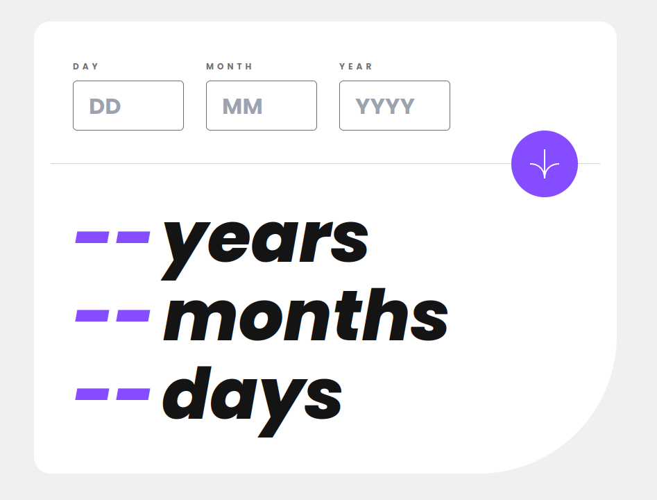

# Frontend Mentor - Age calculator app solution

This is a solution to the [Age calculator app challenge on Frontend Mentor](https://www.frontendmentor.io/challenges/age-calculator-app-dF9DFFpj-Q). Frontend Mentor challenges help you improve your coding skills by building realistic projects.

## Table of contents

- [Frontend Mentor - Age calculator app solution](#frontend-mentor---age-calculator-app-solution)
  - [Table of contents](#table-of-contents)
  - [Overview](#overview)
    - [The challenge](#the-challenge)
    - [Screenshot](#screenshot)
    - [Links](#links)
  - [My process](#my-process)
    - [Built with](#built-with)
    - [What I learned](#what-i-learned)
    - [Useful resources](#useful-resources)
  - [Author](#author)

## Overview

### The challenge

Users should be able to:

- View the optimal layout for the site depending on their device's screen size
- See hover states for all interactive elements on the page
- Toggle color theme to their preference

### Screenshot

### Links

- Solution URL: [here](https://www.frontendmentor.io/solutions/age-calculator-react-tailwindcss-a8KxieMYZq)
- Live Site URL: [here](https://rhiino1.github.io/fm-age-calculator/)

## My process

Sames as always, mobile first workflow, some react, some tailwind. I hate doing validation from scratch, I know there is some React-form validation but I wanted to do it by myself.

### Built with

- Semantic HTML5 markup
- Flexbox
- Grid
- Mobile-first workflow
- [React](https://reactjs.org/) - JS library
- [Tailwindcss](https://tailwindcss.com/) - CSS library

### What I learned

Validation form sucks.

### Useful resources

- [Tailwindcss Documentation](https://tailwindcss.com/docs) - There is all the information and knowledge you need to start learning Tailwindcss. -[React-hook-form, tailwindcss and Yup for form input validation](https://www.uchaudhary.com.np/blog/react-form-with-react-hook-form-yup-and-tailwindcss) - There is a simple way to validate inputs with React and Tailwind.

## Author

- Github - [Cesar SC](https://github.com/Rhiino1)
- Frontend Mentor - [@Rhiino1](https://www.frontendmentor.io/profile/Rhiino1)
- Twitter - [@Rhiino_1](https://www.twitter.com/Rhiino_1)
